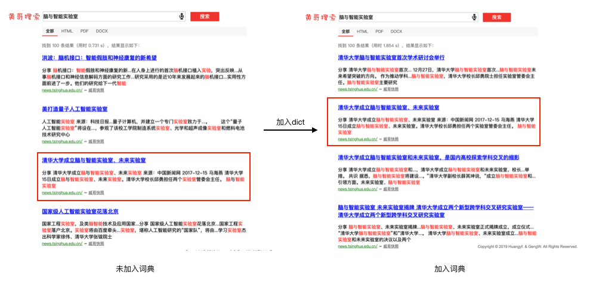

# <center>搜索引擎大作业——校园搜索实验</center>

<p align=right><font size=2px>黄宇飞 2016011259 耿威 2016011249 姜东槿 2014080043</font></p>

## 实验概况

### 实验要求及内容

抓取清华校内绝大部分网页资源以及大部分在线万维网文本资源（含M.S. office文档、pdf文档等，约20-30万个文件），实现基于概率模型的内容排序算法，图片检索实验已经让大家实现对查询不分词的BM25模型，建议改写框架相或查找开源资源在其之上进行加工。

综合运用搜索引擎体系结构和核心算法方面的知识，基于开源资源搭建搜索引擎，具体包括如下几点: 

1. 抓取清华校园网内绝大部分资源，并且进行预处理;

2. 基于Lucene实现校园搜索引擎

3. 加入关键词纠错，查询提示，语音搜索，以提高搜索的体验;

4. 美化Web界面，高亮、快速等功能;

### 实验环境

+ JAVA JDK >= 10.0
+ Lucene-8.1.1
+ JGraphT-1.3.0
+ IK Analyzer 2012FF_hf1
+ poi_jars-4.1.0
+ pdfbox_jars-2.0.15
+ javax.servlet-api-4.0.1
+ jsoup-1.12.1
+ apache-tomcat-9.0.21
+ heritrix-3.4.0-SNAPSHOT

### 实验运行方式

首先通过`CalPageRank.java`计算出pagerank的值，并在154行和161行设置数据集的路径和存储pagerank的路径。

```java
File datadir = new File("/Users/huangyf/Dataset/SearchEngine/Big");  // your data path
calPageRank.printPageRank("/Users/huangyf/Desktop/大三春季学期/搜索引擎技术基础/Homework/3BigHomework/ImageSearch/forIndex/pagerank.txt");   // your store pagerank path
```

然后运行`ImageIndexer.java`来建立索引，需要在437行、438行、439行设置索引的存储路径、数据集路径、pagerank的读取路径（`CalPageRank.java`的写入路径）。

```java
String indexpath = "/Users/huangyf/Dataset/SearchEngine/apache-tomcat-9.0.21/bin/forIndex2";                   // index store path
String datapath = "/Users/huangyf/Dataset/SearchEngine/Big";  // pagerank load path
File rootdir = new File("/Users/huangyf/Dataset/SearchEngine/Big");  // data path
String pagerankpath = "forIndex/pagerank.txt";              // average length store path
```

之后会在indexpath对应的文件夹下获得我们建立好的index。

之后我们需要将indexpath指定的文件夹放置在tomcat的bin文件夹中，将爬下来的数据资源放在tomcat的webapps目录下，同时还有WebRoot的pic文件夹以及其他文件都复制到webapps目录下，在IDE中打开整个项目之后，设置tomcat部署的根目录为webapps目录。

添加依赖包：将tools文件夹中所有jar包以及WebRoot/WEB-INF-lib下的所有jar包加入到项目的依赖项中。

之后在IDE中运行Tomcat项目即可。

另外需要注意的是数据集文件夹组织形式应该如下：

+ ROOTDIR(`Big` in the code above)

  + DIR1
    + url1
    + url2
    + ...

  + DIR2
    + url1
    + url2
    + ...
  + ...

> 项目的Github地址为https://github.com/huangyf530/DocumentSearch

## 实验过程

本次实验过程分为三部分：爬取数据、完成基本的搜索功能（基于BM25概率模型）、功能扩展。下面对每个过程进行详细的说明。

### 爬取数据

本次爬取数据使用的是Heritrix的开源项目，版本为`heritrix-3.4.0-SNAPSHOT`，通过命令行启动后，设置新的`job`来爬去内容。由于我们制作的是校园搜索引擎，所以我们需要配置一下其中的`crawler-beans.cxml `，首先需要设置爬取网页的根结点，即从以下网页开始通过搜索策略爬取：

```xml
http://news.tsinghua.edu.cn
http://www.cs.tsinghua.edu.cn/
http://graduate.tsinghua.edu.cn
http://member.artmuseum.tsinghua.edu.cn
http://search.tsinghua.edu.cn
http://ticket.artmuseum.tsinghua.edu.cn
http://tv.tsinghua.edu.cn
http://www.artmuseum.tsinghua.edu.cn
http://www.tsinghua.edu.cn
http://www.tuef.tsinghua.edu.cn
http://yz.tsinghua.edu.cn
http://zhaopin.rsc.tsinghua.edu.cn
http://student.tsinghua.edu.cn
http://www.dangjian.tsinghua.edu.cn
http://academic.tsinghua.edu.cn
http://myhome.tsinghua.edu.cn
http://career.tsinghua.edu.cn
http://pt.tsinghua.edu.cn
http://kyybgxx.cic.tsinghua.edu.cn/kybg/index.jsp
http://guofang.tsinghua.edu.cn
http://info.itc.tsinghua.edu.cn
http://thdag.cic.tsinghua.edu.cn
http://xsg.tsinghua.edu.cn
http://info.tsinghua.edu.cn
```

然后需要对爬取内容进行限制，只爬取其中的pdf文件、word文档和html源码文件。

在`org.archive.modules.deciderules.MatchesListRegexDecideRule`下`REJECT`的action下使用正则表达式进行限制：

```xml
^(?:(?!\.html)(?!\.htm)(?!\.pdf)(?!\.PDF)(?!\.doc)(?!\.docx)(?!\.DOC)(?!\.DOCX)(?!\.htmlx)(?!\.HTML)(?!\.HTM)(?!\.HTMLX).)+
```

同时由于学校的规定，不能爬取学校图书馆的资源：

```xml
[\S]*lib.tsinghua.edu.cn[\S]*
```

同时由于采用的是搜素策略，所以为了防止通过网页上的链接爬取到非清华网页，所以需要在`org.archive.modules.deciderules.surt.SurtPrefixedDecideRule`下的`acceptSurts`中加入：

```xml
+http://(cn,edu,tsinghua
```

表示只能接受以`tsinghua.edu.cn`结尾的网页。

为了防止爬取到重复的内容，我们再给爬取取消掉了`canonicalizationPolicy`的判别重复网页策略的注释。结果如下：

```xml
<bean id="canonicalizationPolicy" 
   class="org.archive.modules.canonicalize.RulesCanonicalizationPolicy">
   <property name="rules">
    <list>
     <bean class="org.archive.modules.canonicalize.LowercaseRule" />
     <bean class="org.archive.modules.canonicalize.StripUserinfoRule" />
     <bean class="org.archive.modules.canonicalize.StripWWWNRule" />
     <bean class="org.archive.modules.canonicalize.StripSessionIDs" />
     <bean class="org.archive.modules.canonicalize.StripSessionCFIDs" />
     <bean class="org.archive.modules.canonicalize.FixupQueryString" />
    </list>
  </property>
 </bean>
```

这样我们就完成了对爬取内容的所有限制条件。

启动爬虫后，经过3d7h45m的爬取过程，爬取到218901个网页内容，共25GB的内容，取其中600MB作为测试数据集。


### 基本功能的实现

基本功能的实现涉及到四个过程，分别是数据解析并建立索引、计算PageRank、调整分数的比重与计算方式、前端展示。这里的建立索引与搜索过程都使用了lucene8.1.1的框架一级IKAnalyzer的分词工具。计算PageRank使用了JGrapghT工具。前端展示和与后端的交互则采用了Tomcat9.0.21实现。

#### 数据解析并建立索引

在获得大量的网页数据之后，我们需要通过对得到的信息进行加工，提取其中的关键信息，以此来构建我们在之后查询所需要的索引信息。这一步相当于搜索引擎中的内容索引子系统的工作。这里使用了lucene8.1.1中的`IndexWriter`来实现，改类可以自动调用设定的分词工具对String进行解析并构建不同的Field用于在查询中提供不同方式的查询与获得信息。构建索引过程中我们需要做的是有效的提取出html文件、pdf文件和word文件中的内容。

+ **HTML文件解析**

  html文件解析使用了jsoup这一工具包。这里经过不断的实验，最后决定提取的html中信息工分为两种，分别是title和content。

  title的构建是通过将html文件中`title`标签内容和`h1`中内容组合在一起得到，如果二者相互包含，则取较长的那个作为title。

  content的构建主要是通过body标签获得，但也对其中内容进行了加工，首先将`header`和`footer`中的信息删除，这是因为我们做的是校园搜索系统，所有的网页的header中基本都为导航栏信息，其中几乎都是同样的内容，这种大量重复的内容对搜索结果有很大的影响，同样footer中的信息也是如此。对于有些没有把导航栏信息加入到header的网页，其导航栏一般对应class为header或nav，我们通过遍历同样可以把这个删除。最后得到的body中的text就是我们认为的html文件的content。

+ **PDF文件解析**
  
  PDF文件解析使用了PDFbox这一工具包，具体使用的是其中的PDDocument和PDFTextStripper两个类。
  
  在处理内容时，由于许多PDF文档解析之后开头有许多空行或空格，在最开始用第一个换行符分开标题和内容的方法效果不好。最终我们采用的方法是跳过文章开头的空格以及换行符，在开始有文本内容的时候记录本行为title，从下一行开始到最后为content。

+ **Word文件解析**

  Word文件解析使用了POI的HWPF和XWPF两个工具包，分别解析.doc和.docx两类文件。在获得字符串信息后，处理细节与PDF类似，最终得到Word文件的title和content。


实现文件的解析之后，对于任何一个文件，我们都有着其title，content等内容信息。我们将这两个内容信息分别作为title和content域加入到文档对应的Document中。同样为了实现之后前端展示的一些功能，我们还需要提供该文件的url来实现点击之后跳转到对应的网页，文件的type信息实现关于类型的垂直查询，文件的本地路径path实现快照的功能，以及下一步介绍的pagerank值来改进搜索结果。由于爬虫爬取的数据都是按照网址进行分类，所以只要通过对文件的递归解析就可以得到其对应的url和path等信息。这样一个Document会关联六个域，分别是：

```java
Document document  = new Document();
Field contentField  = new TextField("content" ,content,Field.Store.YES);
Field titleField = new TextField("title", title, Field.Store.YES);
Field urlField = new StringField("url", url, Field.Store.YES);
Field typeField = new StringField("type", type, Field.Store.YES);
Field scoreField = new FeatureField("features", "pagerank", boost);
Field pathField = new StringField("path", path, Field.Store.YES);
```

由于我们要使用的是BM25的概率模型，而lucene默认的模型为向量空间模型，我们需要手动设置indexWriter的相似函数为BM25相似函数（lucene8.1.1自带的BM25相似函数）。

```java
IndexWriterConfig iwc = new IndexWriterConfig(analyzer);
iwc.setOpenMode(IndexWriterConfig.OpenMode.CREATE);
Directory dir = FSDirectory.open(Paths.get(indexDir));
iwc.setSimilarity(new BM25Similarity());
indexWriter = new IndexWriter(dir,iwc);
```

由于一些pdf文件和Word文件处理时会遇到错误，最终我们建立索引的文件共有173753个，其中html文件162921个，pdf文件8746个，word文件2086个。

#### 计算PageRank

计算PageRank使用了JGraphT的包，改java包提供了很好的pagerank的支持，只要把每个节点加入到图中，并将网页之间的相互引用作为边加入到图中，之后调用PageRank类就可以实现pagerank的计算。这里需要我们做的就是提取网页之间的相互引用关系，这里提取关系同样适用了Jsoup包，其中的很多连接并不是指向一个网页，这些链接并不需要加入到PageRank的计算中，所以进行一次判断，判断该链接是否包含.htm或.html字符。同时由于有些是相对地址，需要通过Java中的Path类将其修改为绝对地址。最后得到的图中256599个url，pagerank的数值都分布在$10^{-3} ～10^{-6}$之间，主要数量级在$10^{-5} ～ 10^{-6}$ ，平均值为$3.897364\times 10 ^{-6}$。这个之后在加入到域中时采用对应的pagerank值除以平均值的方法得到一个更大一点的数值，对于pdf和Word文件，该域的值都为1。

#### 分数的计算

通过在小数据集上的不断测试，最终分配给不同域的权值为：

+ title：8
+ content：0.7

PageRank的引入有些复杂，采用的是如下的计算公式:

$PageRank\_Score = \frac{20 \times pagerank}{k + pagerank}$

其中$k$为lucene自动根据给定的pagerank算出来的常数，按照官方文档的解释应该是该域的几何均值，在我们的例子中，$k=0.55859375$。这样的方法可以防止因为PageRank过大导致一些结果总是排在前列。

结合了PageRank和BM25的分数以及调整了合适的权重之后，对于一个搜索可以给出很好的结果排序：

如搜索“计算机科学与技术系”可以得到以下结果：


我们可以看到结果中的前几名都是清华大学计算机科学与技术系的官方主页，前几名的分数也很接近，相差不到1，而官方主页的首页也排在了第4位。但在不使用PageRank的情况下，官方主页的首页排名极其靠后，主要是由于首页中并没有太多内容，所以在内容得分上比不过很多其他的页面，这种情况下排在前面的都是一些夏令营的报名通知、重要会议的通知等内容比较丰富的页面。

#### 前端展示

在前端展示上，我们希望做到力求美观，在配色上采用了浅红色调。

首先我们在第三方网站为我们搜索引擎的名字生成了美观的名字加到了前端，另外在输入框中显示了灰色提示信息（正常状态下提示“请输入要查询的关键字”，语音输入时显示“Speak now”），力求做到用户友好。

输入框的最左端设置了一个小放大镜的logo做背景；在选中输入框时，我们的输入框的边框会高亮，还加了亮度向外扩散逐渐衰减的效果，更加美观。语音输入用logo按钮触发，位置在输入框的最右端，让用户一目了然。


结果显示页面，我们模仿百度实现了一个美观的分栏器，让搜索结果可以按类型呈现给用户；同时我们还用灰色字体告知用户搜索结果数量以及搜索用时。每一条结果的显示均仿照主流搜索引擎的效果进行了实现，包括匹配位置高亮、快照功能入口等。

### 功能的扩展

在完成基本功能的情况下，我们也做了一些功能上的扩展。主要扩展有如下几点：语音搜索、模糊查询、垂直搜索、匹配结果高亮显示、网页快照以及自定义了包含清华专有名词的字典以提高分词准确率。

#### 语音搜索


#### 模糊查询

这里的模糊查询是针对分好词之后的term进行的，这里接受的模糊查询的标准为editdistance为1，即相互之间的差别不能超过一个字。

具体实现是通过lucene提供的FuzzyQuery实现，该Query能够自动根据提供的Term，找到在索引中与之编辑距离为1的所有词并通过Boolean中或的方式结合在一起。

如我们搜索 “计算机课学与技术系”，仍然会得到以下的结果：


该查询的分词结果是“计算机课 学 技术 系”，而结果中仍然搜索到”计算机系“相关的内容，这就是由于”计算机课“这样的Term与”计算机系“之间的Term的Edit Distance为1，所以也进行了”计算机系“相关的搜索。

但这样的模糊查询也存在很大的问题，由于中文进行查询时都需要进行分词，如果由于不正确的字而导致分词出现偏差，最后的结果就会有很大的不同。

#### 垂直搜索

可以看到我们的搜索结果界面最上方有一个导航栏可以选择不同类型的结果，不同的类型下只显示对应的结果。如我们点击PDF会有如下界面：


结果就都是PDF文件。该灵感来源于Google的搜索结果页面中可以选择不同的垂直结果，这样的方法可以让用户实现更有针对性的搜索，因此我们也对文件的类型进行了区分。

实现该垂直搜索的方式是每次搜索会传会后端搜索类型，然后根据类型在Query中加入对type域的搜索，并加入到BooleanQuery中设置为MUST，即必须满足，进而实现了不同类型的垂直搜索。

#### 网页快照

网页快照即为通过本地的缓存将将结果进行快速展示的过程，由于我们都有本地的文件存储，只需要将其连接到本地的对应的html文件就可以实现网页快照的功能。

#### 匹配位置高亮显示

匹配位置高亮显示使用了Lucene包中的Highlighter类实现。通过在匹配文字前后加上`<font color='red'>`和`</font>`可直接实现结果的红色显示。具体代码如下：

```java
private void highLightDisplay (TopDocs topDocs, Query queryToSearch, String[] contents) throws InvalidTokenOffsetsException, IOException {
  ScoreDoc [] scoreDoc = topDocs.scoreDocs;
  SimpleHTMLFormatter simpleHTMLFormatter = new SimpleHTMLFormatter("<font color='red'>", "</font>");

  Highlighter highlighter = new Highlighter(simpleHTMLFormatter, new QueryScorer(queryToSearch));
  highlighter.setTextFragmenter(new SimpleFragmenter(20));
  for(int i = 0; i < scoreDoc.length; i++){
    int id =scoreDoc[i].doc;
    Document docHit = getDoc(id);
    String text = docHit.get("content");
    TokenStream tokenStream = analyzer.tokenStream("content", new StringReader(text));
    String highLightText = highlighter.getBestFragments(tokenStream, text, 5, "...");
    contents[i] = highLightText;
  }
}
```

该段代码会找到5个最好匹配的位置病进行高亮显示之后的字符串返回。

#### 自创清华词典

由于IKAnalyzer可以方便的扩展词典与停用词，我们为了分词结果更加合理，通过在info上的查询，将清华所有院系的全称与简称以及大部分建筑和组织的名字都录入到我们的词典中(dic/mydict.dic)，以此实现更加合理的分词，搜索结果页能得到很大的优化。如我们搜索“脑与智能实验室”，若不在词典中加入该词的结果，分词结果为“脑 智能 实验室”，而由于实验室在很多文档中都有出现课，所以排名靠前的结果并不一定是相关的结果。加入改词前与加入后的搜索结果对比如下：



可以看到一个最佳结果明显提前，而且在未加入dict之前，结果中其他三个都是无关结果，和要搜索的东西没有太大关联，而加入该词之后的结果中全部都是相关结果，效果有了明显的提升。

## 实验总结

通过自己建立一套完整的搜索引擎机制，体会了搜索引擎三个子系统的功能差别与相互关联。通过不断调整权重对比了不同的排序方法与Score计算结果，并加入PageRank的来优化结果，对链接分析有了更深的理解。通过不断的加入新的方法调整最后结果的排序也体会到了不同的因素对搜索引擎结果的影响。最后也成功将这些功能与机制组合在一起完成了我们校园搜索引擎的搭建，是一次对课堂知识的很好的实践。
